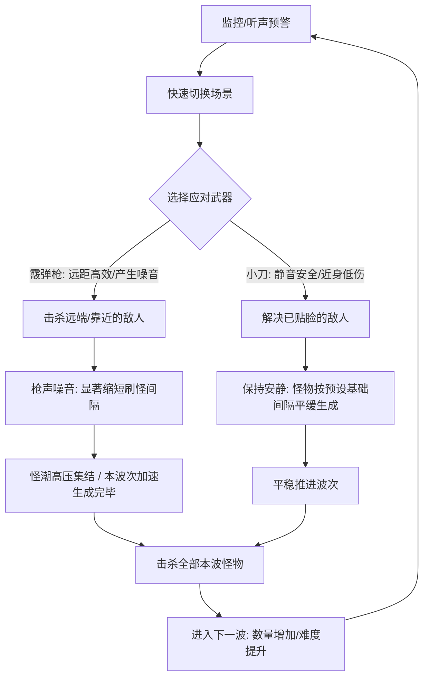
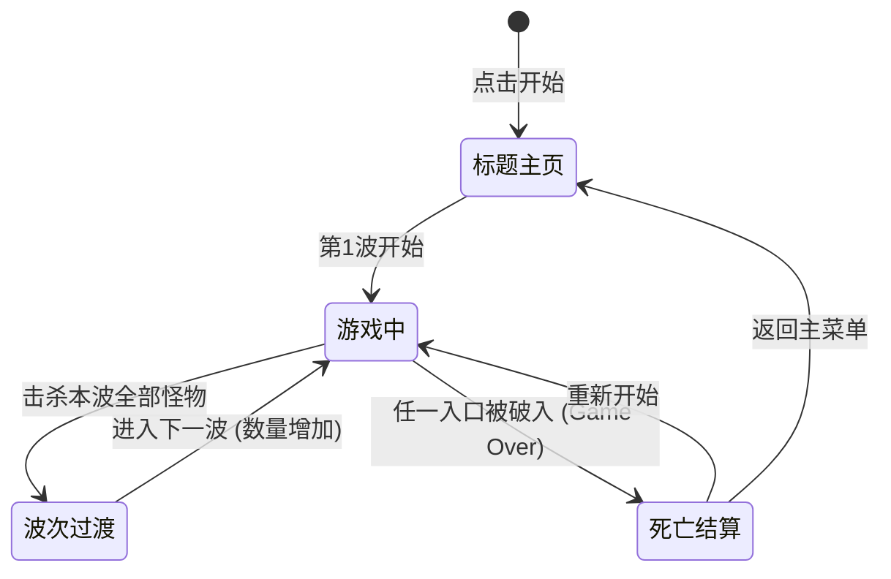

# 《ZomboidLife》产品需求文档 (PRD)

---

## 1. 文档与项目概况

*   **项目类型**：Web 端第一人称微操生存 / 防守恐怖小游戏（轻量级，FNAF 式多点监控防守 + FPS/冷兵器战斗）
*   **运行环境**：主流 PC Web 浏览器
*   **核心体验**：多视角快速切换、听声辨位与防守决策、波次怪潮应对、高风险（开枪引怪加速）与低风险（静音近战）的权衡。
*   **获胜/失败条件**：
    *   **获胜**：无终点（无尽波次生存模式），活得越久、通关波次越多越好。
    *   **失败**：任一入口被完全突破且未被阻止，触发 Game Over。

---

## 2. 核心游戏循环 (Core Game Loop)

---

## 3. 场景与视角系统 (Scenes & Switching)

玩家固定在建筑中心，可在 **3 个场景界面间无缝/无延迟即时切换**（支持快捷键或 UI 按钮）。

| 场景编号 | 场景名称 | 核心交互与防御点 | 危险突破与容错机制 (Fault Tolerance) |
| :--- | :--- | :--- | :--- |
| **Scene 1** | **正门 / 监控台** | • **监控屏幕**：可查看各路外部摄像画面。 • **正门木板**：木板有 3 层防御。 • **室内自动机枪**：应急容错装置。 | 怪物逐层拆除木板； • **容错机制**：木板首次被完全攻破时，**室内自动机枪自动开火全歼正门走廊所有僵尸**，随后机枪弹药耗尽； • **失败条件**：正门无木板且机枪耗尽后，若新僵尸破门直接触发 Game Over。 |
| **Scene 2** | **窗户** | • 观察窗外动静，可远距离瞄准射击。 • 近距离挥刀阻止破窗。 | 怪物靠近先产生预警声响；若放置数秒不处理，怪物破窗而入触发 Game Over。 |
| **Scene 3** | **活板门 (地窖/下层梯子)** | • 活板门与下方梯子。 • **预设机关陷阱**：应急容错装置。 | 怪物顺梯爬上敲击活板门； • **容错机制**：活板门首次被撞开破坏时，**预设重石落锤陷阱触发，瞬间砸死梯子上所有怪物**，随后陷阱消耗； • **失败条件**：活板门破坏且陷阱耗尽后，新怪物爬出梯口触发 Game Over。 |

---

## 4. 武器与战斗系统 (Weapons & Mechanics)

> **设计原则**：无武器耐久限制、无弹药备弹总数限制、无复杂资源管理。核心机制在于**弹夹容量**与**声音风险**。

### 4.1 泵动式霰弹枪 (Pump-Action Shotgun)
*   **定位**：强力远/近击杀工具，容错高但代价大。
*   **特性**：
    *   可在中远距离直接击毙尚未到达门前的僵尸。
    *   **8 发大弹容**：单弹夹容量 8 发。
    *   **逐发装弹机制 (Shell-by-Shell Reloading)**：单发压弹装填（约 500ms/发），**装填过程中可随时开火打断**，立即击发已装入的弹药。
    *   **声音机制（核心）**：开枪瞬间产生极高噪音，会**在数秒后的一段时间内缩短当前波次僵尸的刷新间隔（Spawn Interval）**，导致原本分散刷新的僵尸迅速扎堆出现，迫使本波次快速进入高压怪潮。

### 4.2 战术刀 (Knife)
*   **定位**：近身防御工具，操作风险高但隐蔽。
*   **特性**：
    *   攻击距离极短（仅限怪物到达入口/正在破坏门窗时使用）。
    *   伤害较低（可能需要连击 1~2 次才可击杀）。
    *   **静音机制**：击杀几乎不发出声响，不会扰动刷怪时钟，怪物维持正常的生成节奏。

---

## 5. 怪物与 AI 设计 (Enemies)

| 怪物名称 | 攻击路径 | 行为模式与威胁点 | 核心应对策略 |
| :--- | :--- | :--- | :--- |
| **Walker (行者)** | **仅走正门 (Scene 1)** | 移动平稳，靠近后开始拆木板。拆板时发出明显的撞击声与木屑碎裂声。 | 远距离霰弹枪击毙，或等其拆板时近身切刀/开枪处理。 |
| **Laugher (笑者)** | **仅走窗户 (Scene 2)** | 移动速度较快。靠近窗户时会发出诡异笑声/敲玻璃预警，数秒后立即破窗。 | 听到笑声需迅速切至窗口，在其破窗前击杀。 |
| **Mimic (拟态者)** | **仅爬梯子 (Scene 3)** | 沿梯子向上爬并敲击活板门。 **特殊机制**：会随机模仿 Walker 的拆门声或 Laugher 的笑声，干扰玩家的听觉判断。 | 依赖**监控画面**或频繁切到地窖场景核实，避免被假声音误导。 |

---

## 6. 监控与感知系统 (Perception)

1.  **监控画面 (CCTV)**：
    *   集成在 **Scene 1 (正门)** 的桌面屏幕上。
    *   可观察 3 个入口外的远端区域（正门外走廊、窗外花园、地窖梯子下方）。
    *   主要用途：**验证声音来源的真伪（尤其是排查 Mimic 的拟态声）**，提前了解来袭波次。
2.  **音频提示 (Audio Cues)**：
    *   采用立体声/空间音频：左/中/右声道分别对应不同方位的动静。
    *   拆木板声（正门）、敲玻璃/笑声（窗户）、梯子摩擦/门板撞击声（活板门）。

---

## 7. 波次进攻与刷怪算法 (Wave & Spawning Mechanics)

### 7.1 波次设计 (Wave Structure)
*   **定量波次**：僵尸采用**波次制 (Wave-based)** 进攻。
*   **每波数量固定**：每一波的僵尸总配额 $N_{wave}$ 为固定值（随波次增加递增，如：第 1 波 6 只，第 2 波 10 只，第 3 波 15 只……）。
*   **波次结束判定**：当且仅当本波次的所有僵尸**均已生成并被玩家击杀**后，当前波次结束，短暂休整（如 3~5 秒）后自动进入下一波。

### 7.2 刷怪算法与生成间隔 (Spawning Algorithm)
*   **生成队列池**：每波开始时，系统根据当前波次等级，按权重预先生成本波怪物的类型队列（Walker / Laugher / Mimic）。
*   **基础刷新间隔 ($T_{base}$)**：在无噪音扰动下，怪物按照预设的基础间隔（如每隔 4~6 秒生成 1 只）依次向各入口进发。
*   **噪声与刷新加速机制 (Noise Acceleration)**：
    *   玩家开火（霰弹枪）会瞬间产生**噪声冲击 (Noise Spike)**。
    *   噪声会直接**削减下一次或后续数只怪物的刷新等待时间**（例如将 5 秒刷新间隔压缩至 1 秒甚至立即刷出）。
    *   **战略博弈**：开枪虽然能瞬间解围，但会促使本波剩余僵尸以前所未有的速度全部涌出；使用小刀近战则能保持刷怪节奏平缓受控。

---

## 8. 游戏流程与结算界面 (Flow & End Game)

### 结算展示数据（极简）
*   **生存总时长**：`00:00:00` (分:秒:毫秒)
*   **击杀总数**：`XX 只`
*   **坚持波次**：`第 X 波`
*   **个人历史最佳**：最高生存时间 / 最高击杀数 / 最高波次

---

## 9. 界面 (UI) 与按键操作映射

### 9.1 HUD 布局建议
*   **顶部**：当前波次（Wave X）、当前生存时间计时器、简易状态提示。
*   **中央**：当前场景第一人称视角、准星、门窗耐久状态（视觉呈现，如破损的木板）。
*   **底部**：
    *   武器栏（霰弹枪当前弹药 / 换弹进度条 / 小刀）。
    *   场景切换快捷按钮（[1] 正门监控 | [2] 窗户 | [3] 活板门）。

### 9.2 键鼠操作
*   `A / D`：快速轮盘切换场景。
*   `鼠标右键`：切换武器。
*   `鼠标左键`：攻击。
*   `鼠标移动到画面下方`: 换弹。
*   `Space` 或 `点击屏幕监控`：放大查看 CCTV（如果在 Scene 1）。
