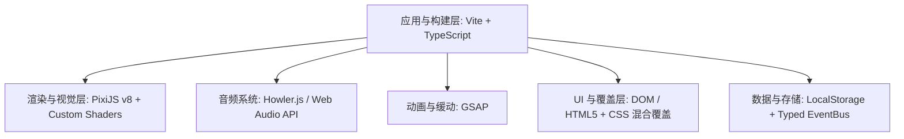
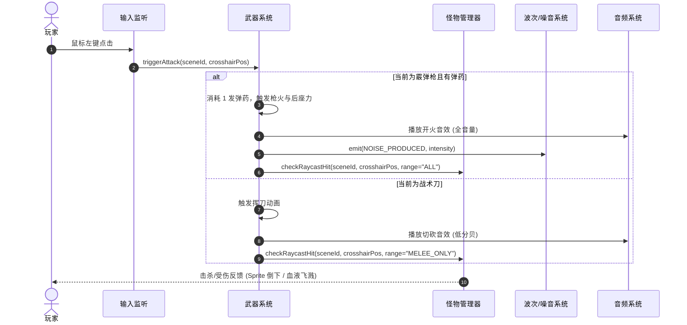
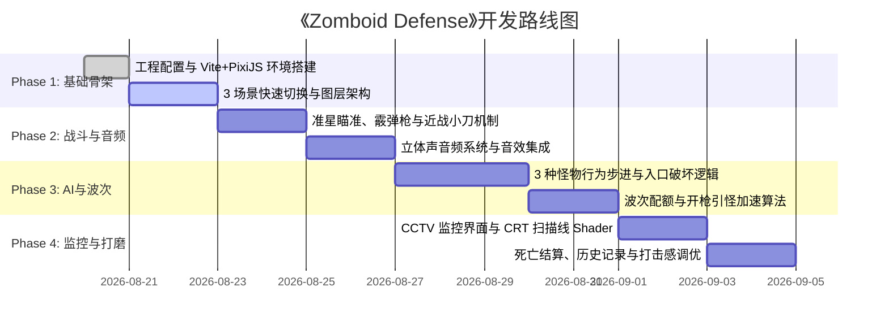

# 《Zomboid Defense》系统架构与技术选型设计文档 (System & Technical Design)

---

## 1. 概述与设计目标

本文档针对 [PRD.md](file:///home/xcosmos/Projects/PCProjects/ZomboidLife/PRD.md) 所定义的《Zomboid Defense》（Web 端第一人称微操生存 / 防守恐怖 2D 小游戏）进行技术选型确定、系统分层架构划分与关键模块详细设计。

### 1.1 核心设计指标
*   **极致轻量与秒级加载**：纯 Web 端运行，总包体控制在 5MB 以内（含音频和核心素材）。
*   **零延迟视角切换**：3 个核心防御场景（正门、窗户、活板门）切换必须无缝即时响应（0 帧卡顿）。
*   **沉浸式空间音频**：精确的左右声道与环境滤波（低通），支撑听声辨位与 Mimic 拟态欺骗核心玩法。
*   **高可维护性与模块解耦**：基于 TypeScript 的强类型事件流驱动，方便后续扩展怪物种类与武器类型。

---

## 2. 技术栈选型 (Technology Stack)



### 2.1 选型明细与决议

| 模块 | 选用技术 / 库 | 选型理由与考量 |
| :--- | :--- | :--- |
| **构建与开发环境** | **Vite + TypeScript 5.x** | 极速 HMR 实时热重载，开箱即用的模块化打包与静态资源处理，强类型保障数据结构安全。 |
| **2D 渲染引擎** | **PixiJS v8** | 业界顶级 WebGL/WebGPU 2D 渲染性能；支持多图层容器管理、Sprite 序列帧动画与自定义 Post-Processing Filter（CRT 扫描线/噪点）。 |
| **空间音频引擎** | **Howler.js (配合 Web Audio API)** | 原生支持 3D/立体声空间平移（Spatial/Stereo Panning）、音量包络与音频分组控制，兼容性好且 API 简洁。 |
| **补间与打击感** | **GSAP (GreenSock)** | 用于视角切换平移平滑、霰弹枪后坐力震屏（Screen Shake）、木板破坏抖动、伤害飘字与渐变过渡。 |
| **UI 与 HUD 呈现** | **DOM/HTML5 + CSS (绝对定位覆盖层)** | 弹药槽、倒计时、波次提示、结算面板采用 HTML/CSS 实现比 Canvas 绘制更具响应性且字体排版维护成本更低。 |
| **状态持久化** | **原生 Web Storage (LocalStorage)** | 极简存储个人历史最高波次、生存时长、击杀数等数据。 |

---

## 3. 总体系统架构 (Architecture Overview)

```mermaid
graph TB
    subgraph UI_Layer [UI 表现层 (DOM & HUD Overlay)]
        HUD[HUD 顶栏 / 底栏: 波次 / 倒计时 / 弹药]
        Menu[主菜单 & 结算面板]
        CCTV_UI[CCTV 监视器悬浮窗]
    end

    subgraph Core_Engine [核心驱动层 (Game Core & Loop)]
        Ticker[PixiJS Ticker / Game Loop]
        FSM[Game State Machine: Init / Playing / WavePause / GameOver]
        EventBus[Typed EventBus: 全局事件中心]
    end

    subgraph Subsystems [核心游戏子系统 (Game Systems)]
        SceneMgr[Scene Manager: 3 视角图层管理]
        WeaponSys[Weapon & Combat System: 射击 / 刀砍 / 装弹 / 噪音]
        WaveSys[Wave & Spawn System: 配额池 / 噪音加速算法]
        EnemyMgr[Enemy Manager: 行为步进 / 破拆计时 / 状态机]
        AudioSys[Spatial Audio System: 声道平移 / 拟态伪装]
    end

    subgraph Render_Pipeline [渲染流水线 (PixiJS Layer)]
        BgLayer[背景环境层]
        BarricadeLayer[门窗木板防御层]
        EnemyLayer[怪物 Sprite 步进层]
        VFXLayer[枪火 / 刀光 / 震屏层]
        ShaderLayer[CRT / 监控噪点滤镜层]
    end

    Ticker --> FSM
    FSM --> Subsystems
    Subsystems <--> EventBus
    Subsystems --> Render_Pipeline
    Subsystems --> AudioSys
    EventBus --> UI_Layer
```

---

## 4. 核心子系统详细设计

### 4.1 场景管理系统 (Scene Management System)
游戏常驻 3 个场景容器（`DoorScene`, `WindowScene`, `CellarScene`），均挂载在主舞台上，通过调整 `visible` 与 `alpha` 实现瞬间切换：

```text
SceneContainer (主场景)
├── BackgroundSprite (当前视角背景)
├── BarricadeContainer (木板/窗玻璃/活板门分级贴图)
├── EnemyContainer (各距离阶段的怪物 Sprite: Far -> Mid -> Close)
├── AttackFeedbackLayer (命中闪红、木屑粒子、枪口火光)
└── CrosshairSprite (随鼠标移动的准星)
```

*   **视角切换逻辑**：
    *   监听按键 `A / D` 或数字键 `1 / 2 / 3`。
    *   触发时调用 `SceneManager.switchTo(SceneID)`。
    *   利用 GSAP 对当前视角施加微量横向运动模糊/位移，增强沉浸切换感。

---

### 4.2 战斗与武器系统 (Combat & Weapon System)

#### 武器参数与行为规格：
| 属性 / 机制 | 霰弹枪 (Shotgun)                  | 战术刀 (Knife) |
| :--- |:-------------------------------| :--- |
| **攻击距离** | 全距离（中远距离即可击杀）                  | 极近距离（仅限怪物到达入口/拆板时） |
| **弹容量 / 限制** | 8 发 / 弹夹制                      | 无限制 |
| **装弹逻辑** | 鼠标移到画面底部或按 R 键触发装弹 CD (约 1.5s) | 无须装弹 |
| **噪音强度 (Noise Spike)** | **+1.0 (极高)**                  | **0.0 (完全静音)** |
| **操作反馈** | 屏幕剧烈后坐力震颤 + 枪口火光 + 弹壳掉落音效      | 挥刀弧光特效 + 撕裂音效 |

#### 伤害判定流程：


---

### 4.3 波次与刷怪算法系统 (Wave & Spawn System)

#### 核心算法逻辑：
1.  **波次配额生成**：
    $$N_{wave} = 6 + (Wave - 1) \times 4$$
    根据当前波次按概率权重填充怪物生成队列（已降低 Laugher 数量与刷新频率，引入防连续扎堆机制）：
    *   Wave 1：Walker (85%), Laugher (15%, 且上限 1 只)
    *   Wave 2：Walker (65%), Laugher (15%), Mimic (20%)
    *   Wave 3+：Walker (55%), Laugher (15%), Mimic (30%)
    *   **Laugher 频率调控**：队列中 Laugher 之间至少间隔 2 只其它怪物，且波次首位不刷 Laugher；刷出 Laugher 时额外附加 800ms 刷新缓冲。
2.  **噪音与刷怪加速曲线 (Noise Acceleration)**：
    *   系统维护全局变量 `noiseLevel`（初始为 0，开枪后 $+1.0$，随时间指数衰减）。
    *   动态下次刷新间隔：
        $$T_{actual} = \frac{T_{base}}{1.0 + (\alpha \times noiseLevel)}$$
        *(其中 $T_{base} = 3.2s$, $\alpha = 1.6$)*
    *   **效果**：开枪后几秒内，剩余怪物将密集刷出；用刀则维持平缓节奏。

---

### 4.4 空间感知与音频系统 (Audio & Perception)

#### 声道平移配置：
| 音频事件 | 声道平移 (Pan) | 音量 / 滤波 (LowPass) | 说明 |
| :--- | :--- | :--- | :--- |
| **正门拆板声** | `0.0 (居中)` | 无滤波 | 明确的正前方撞击声 |
| **窗户敲击/笑声** | `+0.7 (偏右)` | 轻微高频增强 | 清脆的玻璃刮擦与诡异笑声 |
| **活板门爬行/撞击** | `-0.7 (偏左)` | 开启低通滤波 (800Hz 截止) | 闷响，模拟来自脚下地窖 |
| **Mimic (拟态者)** | **-0.7 (左)** | 播放窗户笑声或正门拆板声，但方位固定在左侧 | 听觉产生矛盾，需查看监控排查 |

---

### 4.5 CCTV 监控与着色器系统 (CCTV & Shaders)

*   **监控台逻辑**：在 Scene 1 点击监控小屏幕或按 `Space` 打开放大版 3 分屏 CCTV。
*   **后处理着色器 (Post-Processing Filter)**：
    *   **扫描线效果 (Scanlines)**：在像素着色器中按 `sin(y * frequency)` 产生交替明暗线。
    *   **动态白噪声 (Noise/Static)**：每帧传入随机 `uTime` 种子生成噪点。
    *   **绿色夜视/单色色调 (Phosphor Green Tint)**：将色彩转为亮度灰阶后乘以 `vec3(0.2, 1.0, 0.4)`。

### 4.6 AI 自主决策与观战系统 (AI Autoplay System)

*   **架构与调度**：`AISystem` 作为独立系统挂载在主循环中，以 80ms 周期量化评估 3 个场景的威胁度。
*   **威胁计算模型**：
    *   **窗户 (Laugher)**：攻击破窗倒计时剩余时间加权计算紧急度（破窗前最高达 2800）；未攻击时威胁度 20~80（AI 保持静默警戒，避免盲目开枪吓退导致死循环）。
    *   **正门 (Walker)**：按木板存量与机枪状态量化（无板无机枪紧急度 2800；拆板中 620~880）。
    *   **地窖 (Mimic)**：撞门且无陷阱紧急度 2700；中段攀爬 660~920；梯底窥探时触发视线压制。
*   **战术行为树**：
    *   **紧急交火**：切入最高威胁场景，霰弹枪优先必杀，0 弹贴脸切刀，远距装填。
    *   **休整与装弹**：安全期及波次结算期自动压满 8 发霰弹枪弹药。
    *   **全域巡防**：无敌情时以 1600ms 周期轮巡 3 场景，消除死角隐患。
*   **实时决策看板**：通过 EventBus 广播思维流与威胁雷达，HUD 呈现 Cyberpunk 决策看板。

---

## 5. 工程代码目录规范

```text
/
├── index.html              # Web 入口与 HTML HUD 覆盖层容器
├── package.json
├── tsconfig.json
├── vite.config.ts
├── src/
│   ├── main.ts             # 游戏启动入口 (初始化 GameApp)
│   ├── assets/             # 音频、图片、字体静态资源
│   ├── core/               # 游戏核心驱动
│   │   ├── GameApp.ts      # PixiJS Application 初始化与生命周期
│   │   ├── EventBus.ts     # 强类型全局事件总线
│   │   └── StateMachine.ts # 游戏状态机 (Menu / Playing / GameOver)
│   ├── config/             # 数值配置与常量 (怪物数值、波次公式、武器属性、AI 参数)
│   ├── audio/              # 音频管理
│   │   ├── AudioManager.ts # 统一音频播放器 (Howler 封装)
│   │   └── SoundDefs.ts    # 音效资源枚举与声像配置
│   ├── systems/            # 游戏系统
│   │   ├── WaveSystem.ts   # 波次配额、队列生成与噪音刷新算法
│   │   ├── WeaponSystem.ts # 武器切换、弹药管理、后坐力与射击判定
│   │   ├── EnemyManager.ts # 怪物状态推进、破坏倒计时与攻击判定
│   │   └── AISystem.ts     # AI 自动决策系统 (威胁评估、战术动作、思维流)
│   ├── scenes/             # 场景与视图
│   │   ├── BaseScene.ts    # 场景基类 (图层挂载、过渡)
│   │   ├── SceneManager.ts # 3 场景切换调度器
│   │   ├── DoorScene.ts    # Scene 1: 正门与监控台
│   │   ├── WindowScene.ts  # Scene 2: 窗户防守
│   │   └── CellarScene.ts  # Scene 3: 活板门防守
│   ├── shaders/            # 自定义 GLSL 着色器
│   │   └── CCTVFilter.ts   # 扫描线与夜视噪点滤镜
│   └── ui/                 # UI 控制器
│       ├── HUDOverlay.ts   # 顶部波次/时间、AI决策看板、底部武器弹药槽
│       ├── StartScreen.ts  # 开始界面 (支持手动与 AI 模式选择)
│       ├── CCTVModal.ts    # 3 路监控分屏模态框
│       └── GameOverModal.ts# 死亡结算与最高记录面板 (支持 AI 重启)
```

---

## 6. 开发迭代路线图 (Milestones)


